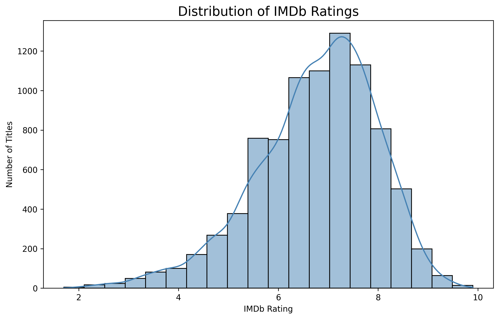
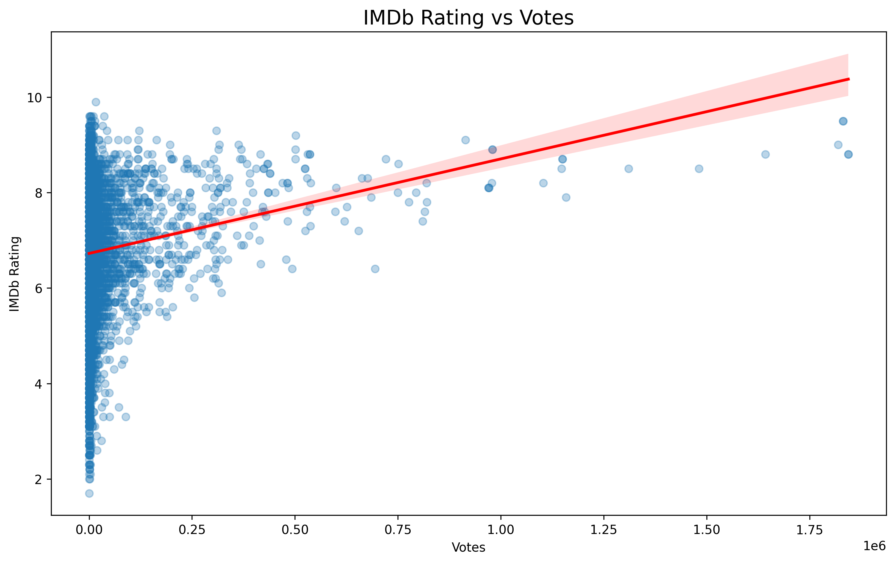
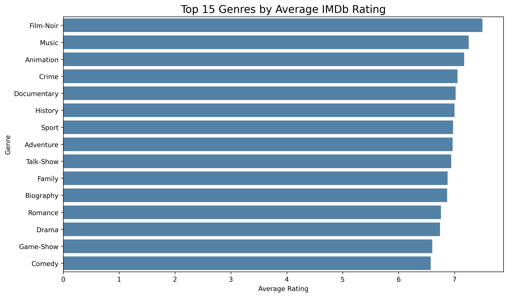
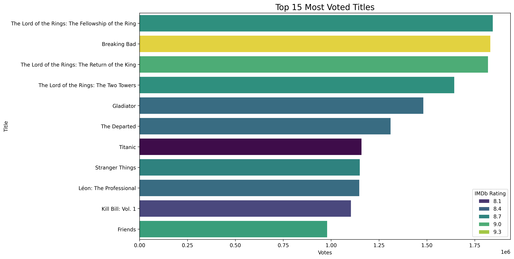

# 🎬 Netflix Data Analysis

Exploratory Data Analysis (EDA) of Netflix Movies and TV Shows using **Python**, **Pandas**, **Matplotlib**, and **Seaborn**.

---

## 📖 Project Overview

This project analyzes a Netflix Movies & TV Shows dataset to discover trends in IMDb ratings, votes, genres, and popular titles.

The project demonstrates the complete data analysis workflow:

- Data Cleaning
- Exploratory Data Analysis (EDA)
- Data Visualization
- Insight Extraction

---

## 📊 Dataset

The dataset contains information about Netflix titles, including:

- Title
- Release Year
- Genre
- IMDb Rating
- IMDb Votes
- Duration
- Certificate
- Description
- Cast

---

## 🛠 Technologies

- Python
- Pandas
- NumPy
- Matplotlib
- Seaborn

---

## 🧹 Data Cleaning

The following preprocessing steps were performed:

- Removed missing values
- Converted IMDb votes into numeric format
- Extracted the primary genre
- Prepared the dataset for analysis

---

# 📈 Exploratory Data Analysis

## IMDb Rating Distribution



The majority of Netflix titles have IMDb ratings between **6.0 and 8.0**, with relatively few titles receiving extremely low or exceptionally high ratings.

---

## IMDb Rating vs Votes



The scatter plot indicates **no strong linear relationship** between IMDb ratings and the number of votes.

---

## Average Rating by Genre



Genres such as **Film-Noir**, **Music**, and **Animation** achieved the highest average IMDb ratings.

---

## Top 15 Most Voted Titles



The most voted titles include world-famous productions such as:

- Breaking Bad
- The Lord of the Rings
- Gladiator
- Titanic
- Friends

---

## 🔍 Key Insights

- Most Netflix titles have IMDb ratings between **6 and 8**.
- IMDb votes are highly right-skewed.
- Popular titles do not necessarily receive significantly higher ratings.
- Film-Noir is the highest-rated genre on average.
- Only a small number of titles account for the majority of IMDb votes.

---

## 📂 Project Structure

```text
netflix-data-analysis/
│
├── data/
│   └── n_movies.csv
│
├── images/
│   ├── rating_distribution.png
│   ├── boxplot_votes.png
│   ├── rating_vs_votes.png
│   ├── top_genres.png
│   └── top_voted_movies.png
│
├── analysis.py
├── README.md
├── requirements.txt
└── .gitignore
```

---

## 🚀 Installation

Clone the repository

```bash
git clone https://github.com/asteris-analytics/netflix-data-analysis.git
```

Install dependencies

```bash
pip install -r requirements.txt
```

Run the project

```bash
python analysis.py
```

---

## 📌 Future Improvements

Possible future improvements include:

- Interactive dashboards with Power BI
- Machine Learning for IMDb rating prediction
- Additional statistical analysis
- Time-series analysis by release year

---

## 👨‍💻 Author

**Asterios Alexandris**

GitHub: https://github.com/asteris-analytics
